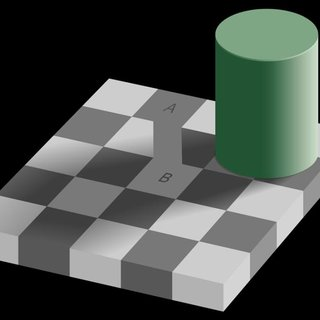

# Outline

    - Intro
    - Image Processing for CV
    - Camera models and views
    - Features and Matching
    - Lightness and Brightness
    - Image Motion and Tracking
    - Classification and Recognition ->
    - MiSC Operations
    - Human Vision

# Details

- 8 Problem Sets
- 1 for basic manipulation
- 1-7 Implementing the algo
- Piazza to communicate in a forum
- Small Exam
- Grading
- I'm suing Python OPEN CV

# 1. Introduction of the course

- I's class on computer vision, aimed to cover fundamentals of analyzing images and extracting content from images. A machine can see and interpret an image.
- mathematical and computanional concepts are covered

# 1. Introduction

- ## What is CV ?

  - Goal is the interpreting/understanding images.
  - Quiz about identifying objects like TV, sofa and actions like waving which can be interpret in various ways if the context not clear

- ## Why CV ?

  - Application to manipulate images becaming core
  - Building 3d images
  - Surveillance
  - Motion Capture

- ## State of the Art: OCR & Face Recognation

  - License plate readers are becoming easy
  - Hand written checks
  - Finding faces in images using cameras, know they can also watch for blinking,smiling
  - Face Recognation

- ## Object recognition

  - Even mobile devices can do it now

- ## Special Effects

  - Motion Capture or 3d object creation is also form CV
  - Areial imagenary into 3d

- ## CV for automotive

  - recognazing street signs and pedestrians
  - Self driving cars

- ## Sports

  - Seperation of objects and drawing lines ...

- ## Game consoles

  - Kintect: Motion Capture / Human Rig

- Surveillance / Medical Imaging

- Why is CV hard? - - Illusion: Our brain does the interpretation of images, making the story/describtion -> that's what CV tries to do

- Seeing isn't same as measuring properties in an image

## Computer Vision with three pillars

- Computational Model - Math - Finding depth using two images
- Algorithm: Correlating two patches to get the deptch
- Real Images: Require experimentation to use it in real life
