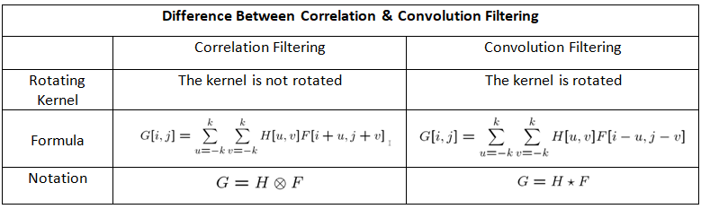
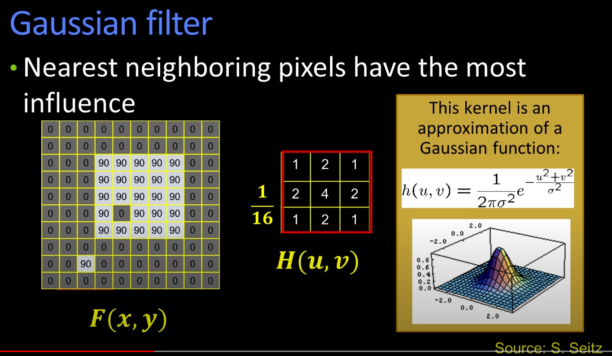
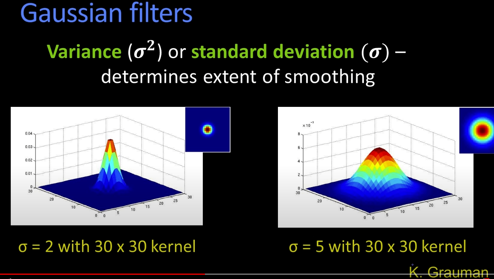

# 1. Images as functions

Image can be described as

- a 2-dimensional array of numbers ranging from some minimum to some maximum
- a function I of x and y I(x,y) where I is the intensity/value of the image
  - For processing the image/function can be smoothed, which can git of the peaks and blurs the image
- something generated by the camera

- Image as a function f from R^2 to R - f is a mapping from RxR or R^2 to R
  - f:[10,210]x[15,165]->[0,10]
  - f: first x bounds then y bounds the intensity bounds
  - f: RxR -> R
- The function has some bounds
  - x from a to b
  - y from c to d
  - range from min to max
    - min black
    - max white
- For colored images three intensity functions can be used to show a color using three color channels

  - r(x,y),g(x,y),b(x,y)
  - f: RxR -> R^3

- Digital Images: operate on discrete iamges

  - Sample the 2d space on a regular grid
  - Quantize each sample (round to nearest integer)
  - Matrix of values, index&j, row&column and x&y

- Noise function:
  - Gaussian noise
  - it can be added to the image

# 2. Filtering

Gaussian noise : noise = randm(size(im))\* sigma
Noise can be added to the image or introduced as a result of taking photo

Removing the noise:

1. Moving average: replace each pixel with an averagae of all the values in the neighborhood
   - Assumptions:
     - real value is similiar to the values nearby
     - each noise independent of other, meaning average of the noises nearby should be 0
2. Weighted Moving Average:

   - Neighbouring pixels get weights
   - Non uniform wma: close neighbours has more weight
   - odd and symmetric number of weight masses is usually preferred

3. Correlation Filtering

   - MA in 2d:
     - a pixel has 8 neighbours, including it self 9
     - you can calculate for range 1 an anverage of these 9 px and replace the one in the middle
     - weights for each pixel is for now 1
     - without circular symmetrix gaussian filter it whould blur the image where the pixel edges are visible

4. Cross Correlation filtering: CA with non uniform weights G = HxF
   - H -> Kernel, Mask, Coefficient, Matrix of linear weights used
     

What makes a good Kernel?

- non uniform weights
- Gaussian filter, circular symmetric guassian function / isotropic - 1 parameter sigma
  
- Variance sigma^2 or standard deviation sigma is the amount of smoothing
  
- Larger sigma doesnt mean larger kernel
- Kernel has to be big enough, so larger sigma doesnt effect the result

# 3. Linearity and convolution

- for linearity two properties hold

  - additivity
  - multiplicative scaling

- Linear oeprations: Sum, Average but Max doesnt change and square root not linear
- Impulse Function and Response
  - Impulse is the building blocks of a function, single point with a value 1
  - In continues world it has an area 1
  - Impulse causes a response in a system ->
    - knowing the impuls and the corresbonding response allows
    - us to have a model
  - Correlation filter could be flipped because how it's applied
  - Question: Filter/Kernel MxM and image NxN -> how many multiplies to filter the image - M^2xN^2 -> every pixel has to be multiplied the ones of the pixel for all pixels in the image
- Convolution flips the direction in the eq. -> Kernel
- Correlation flips the input and gives flipped response
- Convulition takes the flipping into account while calculating

- You have image and your Kernel/Filter with a specific size, if you apply the filter using correlation the output will be flipped in both directions but the convulution takes this flipping during calc into account, so the output is correct.
- For symmetrical filters no difference there, only if derivatives are needed in the calc.

- Properties of Convolution

  - Shift invariant -> operator behaves everywhere the same
  - Uses linear operators, adding , mutpyling:
    - commutative
    - associative
    - Identity
    - Differentiation - subtraction and multiplication - is linear operator
      - Derivative of one of the elements and convolving the other one, maybe?

- To reduce the amount of operations during filtering:

  - image has M^2 pixels
  - filter has N^2 pixels
  - total operations would be m^2n^2
  - but filter sometimes be linearly sperable / seperate into two vectors with different direction, where multiplication results in the original filter which leads to
    - 2N \* M^2 << M^2 N^2 operations

- Boundary issues with filtering

  - you place the middle of the filter into the corner and tell what to do with the not touching pixels
    - Clipping the image with black boundaries can cause black leaks
    - Wrap around, resumes the image using the end of the images, assuming periodic images, which causes artifacts
    - Extending the values,
    - The edges are reflected -> the results are good

- Median Filter - Not a linear filter:

  - meadian sometimes is better at finding appropriate values
  - sort the pixel values and get the middle values, which ignores outliers
    - 10,15,20,30,35,75,80,10,154
  - is not a linear operation
  - also prevents edge smoothing, keeping sharp edges in the data

- Templete matching
  - Filter can be used as templates: Let's the filter is is exactly a part from an image and if apply the filter to the image, do to the nromalized correlation, we get peak values exaclty at where they overlap -> can be used to know if something is in the image
  - can be used for to find icons, faces can be found but not good because the face could face a different direction

# 4 Edge detection

- Compared to template matching, edge detection can allow to identify things
- Edges can describe an image with less information
- change boundaries related to shape or illumination
- Real image:
  - depth
  - shadows
  - textures of the surface
  - surface orientation of bend surfaces
- Edges can be decribed as steep changes of the image function
- Edges is about derivatives with respect to the image function,
- Finding edges is finding max/min or peak in derivatives.
- Applying filter on the derivative function to find the peaks

- Differential operators return some derivatives
- Differential operators modeled as kernels to compute image gradient function
- Define a threshold to find the edges
- Partial derivatives of multivariate Function can be taken (x,y)
- Gradient is the vector made of derivatives
- Gradient points in the direction of most rapid increase in intensity, magnitude would be the amount of change
- We use discrete gradient, right derivative if 1 added
- Sobel Gradient, Prewitt, Roberts for edge operators
- for real images, a smoothing operation before edge detection can lead to better results, Edge detection is sensitive to noise

- In 2d the direction of derivative is important
- Look into the derivative of Gaussian filter if needed
  - small sigma captures finer edges compared to larger sigma

How to find edges: multiple steps: - smooth derivatives to surpress noise and compute gradient - threshold to find the regions of interest - edge thinning - connect edges

Canny edge operator:

1. Filter image with derivative Gaussian
2. Find magnitude and oriantation of gradient
3. Non-maximum suppression: Thin multi-pixel wide ridges to a single one
4. Linking and thresholding
   - two threshold - define and continue the edges
   - High threshold to find strong edges
   - Low threshold to find possible edges which can be connected to the strong ones

Possible steps:

- Convert to garyscale
- Edge function to compute edges with the choice of your model

# 5 Hough transform:Lines

Hough transform is a voting technique, for example each pixel votes for compatible lines, we select the ones with the most votes

Hough space: a line in an image would correspond to point in the space.

Finding parameteric models - for example: line,circle ...

Fitting a paramtric model:

- Choosing model to represent a set of features
- Global membership criterion
- Feasible complexity

From edges to lines: - from a collection of pixels to lines - checking for every possible line is not feasible - voting technique is used - features vote for all compatible models meanin cycling through features and voting - the vote of noise is inconsisntent therefore filtered - Polar coordinate system allows vertical lines without any problem

Hough-Algorithm: - Polar parameterization: xcosTheta - ysinTheta = d - There is an array for the votes, the size of bins decided by me. - - Initialite the H array with 0 - For each edge point we need some quantification / grouping, solve for d - Find the values of d - detect the line
